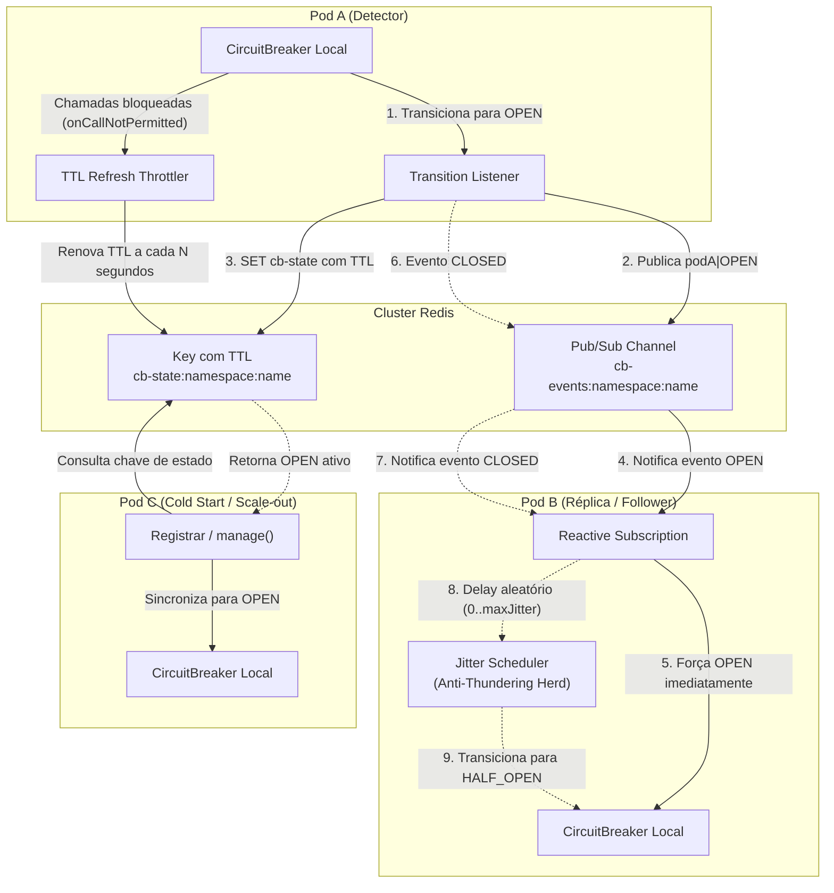

# resilience4j-distributed-spring-boot-starter

Starter para **Spring Boot** que distribui o estado (`OPEN` e `CLOSED`) dos Circuit Breakers do **Resilience4j** entre múltiplos pods e réplicas de um serviço através do **Redis (Pub/Sub + chaves compartilhadas com TTL)**.

Construído para **Java 25+**, **Spring Boot 4.x** (e compatível com 3.x) e **Resilience4j 2.4.0** (`resilience4j-spring-boot4`).

---

## 🎯 Por que usar esta biblioteca?

Por padrão, as instâncias de `CircuitBreaker` do Resilience4j operam exclusivamente **em memória local** de cada JVM. Em uma arquitetura distribuída com $N$ pods:

1. **Colapso amplificado:** Se um serviço externo downstream fica fora do ar, cada pod precisa falhar independentemente até atingir seu próprio limiar (`failure-rate-threshold`) antes de abrir o circuito. Nesse intervalo, dezenas ou centenas de requisições continuam sobrecarregando o serviço já degradado.
2. **Efeito Manada (Thundering Herd):** Quando o serviço começa a se recuperar, todos os pods podem tentar transicionar simultaneamente para teste (`HALF_OPEN`), derrubando novamente o serviço que mal acabou de voltar.

### A solução
Esta biblioteca **mantém o cálculo da taxa de falhas 100% local e ultra-rápido** (sem nenhum lock distribuído ou latência de rede adicionada às requisições do dia a dia), mas **compartilha o resultado**:
- **Ao Abrir (`OPEN`):** Quando qualquer pod detecta a indisponibilidade e abre o circuito, um sinal é transmitido imediatamente via Redis Pub/Sub para todos os outros pods forçarem a abertura imediata de seus circuitos locais.
- **Ao Fechar (`CLOSED`):** Quando o circuito é fechado com sucesso, os outros pods são notificados e aplicam um **jitter aleatório** antes de testar a transição local, evitando bombardeio simultâneo na dependência em recuperação.
- **Novos Pods:** Pods que sobem durante um incidente sincronizam automaticamente o estado `OPEN` consultando o Redis na inicialização.

---

## 📦 Instalação

Adicione a dependência ao seu projeto que consome a biblioteca.

### Gradle (Groovy DSL)
```groovy
repositories {
    mavenCentral()
    // ou seu repositório corporativo (Artifactory / Nexus)
    maven { url 'https://seu-artifactory/libs-release-local' }
}

dependencies {
    implementation 'com.resilience:resilience4j-distributed-spring-boot-starter:1.0.0'
}
```

### Gradle (Kotlin DSL)
```kotlin
repositories {
    mavenCentral()
    maven("https://seu-artifactory/libs-release-local")
}

dependencies {
    implementation("com.resilience:resilience4j-distributed-spring-boot-starter:1.0.0")
}
```

### Maven (`pom.xml`)
```xml
<dependency>
    <groupId>com.resilience</groupId>
    <artifactId>resilience4j-distributed-spring-boot-starter</artifactId>
    <version>1.0.0</version>
</dependency>
```

> **Nota:** As dependências `resilience4j-spring-boot4` e `spring-boot-starter-data-redis-reactive` são resolvidas de forma transitiva pelo starter. Não é necessário declará-las manualmente a menos que queira sobrescrever versões.

---

## ⚙️ Configuração

A biblioteca é **100% plug-and-play**: basta declarar a conexão com o Redis e suas instâncias padrão do Resilience4j no `application.yml` (ou `application.properties`).

### Exemplo de `application.yml`

```yaml
spring:
  data:
    redis:
      host: redis.internal
      port: 6379

resilience4j:
  # -------------------------------------------------------------
  # Configuração da Distribuição via Redis (deste starter)
  # -------------------------------------------------------------
  distributed:
    enabled: true                 # Chave mestre para ativar/desativar a biblioteca
    namespace: meu-servico-prod    # Isola chaves e canais do Redis por serviço/ambiente
    state-ttl: 5m                 # Tempo de expiração do estado OPEN gravado no Redis
    ttl-refresh-interval: 5s      # Throttling de renovação de TTL sob alto tráfego
    max-jitter: 3s                # Atraso aleatório máximo antes de seguir sinal CLOSED
    breaker-names: []             # Vazio = distribui TODOS os circuit breakers registrados

  # -------------------------------------------------------------
  # Configuração Padrão do Resilience4j (sem alterações)
  # -------------------------------------------------------------
  circuitbreaker:
    instances:
      orderService:
        sliding-window-size: 20
        failure-rate-threshold: 50
        wait-duration-in-open-state: 30s
        permitted-number-of-calls-in-half-open-state: 5
      paymentService:
        sliding-window-size: 10
        failure-rate-threshold: 50
        wait-duration-in-open-state: 20s
```

### Propriedades Disponíveis

| Propriedade | Tipo | Padrão | Descrição |
| :--- | :--- | :--- | :--- |
| `resilience4j.distributed.enabled` | `boolean` | `true` | Ativa ou desativa completamente o mecanismo de coordenação distribuída. |
| `resilience4j.distributed.namespace` | `String` | `"default"` | Prefixo para isolar chaves (`cb-state:<ns>:<name>`) e canais (`cb-events:<ns>:<name>`) no Redis. |
| `resilience4j.distributed.state-ttl` | `Duration` | `5m` | Tempo de vida da chave de estado no Redis. Deve ser maior que o `waitDurationInOpenState`. |
| `resilience4j.distributed.ttl-refresh-interval` | `Duration` | `5s` | Intervalo mínimo entre atualizações de TTL quando chamadas são bloqueadas por circuito aberto. |
| `resilience4j.distributed.max-jitter` | `Duration` | `3s` | Limite superior para o delay aleatório aplicado antes de transicionar para `HALF_OPEN`. |
| `resilience4j.distributed.breaker-names` | `List<String>` | `[]` | Lista de nomes de circuit breakers a distribuir. Quando vazio, **todos** os breakers serão gerenciados. |

---

## 💻 Como Utilizar no Código do Projeto

Não é necessário adicionar nenhuma anotação personalizada ou classe de infraestrutura. Use a anotação padrão `@CircuitBreaker` do Resilience4j:

```java
package com.suaempresa.pedidos.service;

import io.github.resilience4j.circuitbreaker.annotation.CircuitBreaker;
import org.slf4j.Logger;
import org.slf4j.LoggerFactory;
import org.springframework.stereotype.Service;
import org.springframework.web.client.RestClient;

@Service
public class OrderService {

    private static final Logger log = LoggerFactory.getLogger(OrderService.class);
    private final RestClient restClient;

    public OrderService(RestClient.Builder restClientBuilder) {
        this.restClient = restClientBuilder.baseUrl("https://api.pagamentos.com").build();
    }

    // O nome "orderService" corresponde à instância declarada no application.yml
    @CircuitBreaker(name = "orderService", fallbackMethod = "fallbackProcessarPedido")
    public String processarPedido(String orderId) {
        return restClient.post()
            .uri("/v1/cobrancas")
            .body(orderId)
            .retrieve()
            .body(String.class);
    }

    // Método de Fallback executado quando o circuito estiver OPEN ou falhar
    public String fallbackProcessarPedido(String orderId, Throwable ex) {
        log.warn("Circuit breaker ativo para pedido {}. Motivo: {}", orderId, ex.getMessage());
        return "PEDIDO_EM_FILA_REPROCESSAMENTO";
    }
}
```

O starter detecta o `CircuitBreaker` nomeado `"orderService"` registrado no Spring e conecta automaticamente o listener reativo e os manipuladores de eventos do Redis.

---

## 🔍 Endpoint de Diagnóstico (Spring Boot Actuator)

Se o seu projeto utiliza `spring-boot-starter-actuator`, este starter registra automaticamente um endpoint reativo e não-bloqueante para inspecionar o status de sincronização:

### 1. Habilite o endpoint no `application.yml`
```yaml
management:
  endpoints:
    web:
      exposure:
        include: health, info, distributedCircuitBreakers
```

### 2. Rotas HTTP disponíveis

- **Todos os breakers gerenciados:**  
  `GET /actuator/distributedCircuitBreakers`

- **Um breaker específico:**  
  `GET /actuator/distributedCircuitBreakers/orderService`

### 3. Exemplo de Resposta JSON

```json
{
  "breakerName": "orderService",
  "localState": "OPEN",
  "localInstanceId": "7c88b201-cf97-40d3-9bc7-60e81cfae532",
  "remoteState": "OPEN",
  "remoteInstanceId": "1b31fa02-99cb-4c31-8902-3c22ad65b701",
  "inSyncWithRemote": true
}
```

Caso o Redis esteja indisponível ou o circuito nunca tenha sido gravado:
```json
{
  "breakerName": "orderService",
  "localState": "CLOSED",
  "localInstanceId": "7c88b201-cf97-40d3-9bc7-60e81cfae532",
  "remoteState": null,
  "remoteInstanceId": null,
  "note": "Nenhum estado compartilhado encontrado no Redis para este breaker (expirado, nunca gravado ou Redis indisponível)."
}
```

> **Importante:** O endpoint é estritamente **somente leitura** (*read-only*), garantindo total segurança para exposição em ambientes produtivos.

---

## 🏛️ Detalhes de Arquitetura e Funcionamento

A biblioteca adota uma arquitetura **híbrida e orientada a eventos**, combinando o cálculo de métricas local ultra-rápido (*in-memory*) do Resilience4j com coordenação distribuída assíncrona baseada no **Project Reactor**, **Lettuce** e **Redis**.



---

### 1. Componentes Internos do Starter e Organização de Pacotes

O starter organiza suas responsabilidades nos seguintes módulos e subpacotes desacoplados:

| Componente / Pacote | Classe Principal | Responsabilidade |
| :--- | :--- | :--- |
| **Auto-Configuração**<br/>`com.resilience.distributed.autoconfigure` | [`DistributedCircuitBreakerAutoConfiguration`](src/main/java/com/resilience/distributed/autoconfigure/DistributedCircuitBreakerAutoConfiguration.java)<br/>[`DistributedCircuitBreakerProperties`](src/main/java/com/resilience/distributed/autoconfigure/DistributedCircuitBreakerProperties.java) | Configura condicionalmente os beans reativos do Redis, mapeamento das propriedades `resilience4j.distributed.*` e o coordenador via `@AutoConfiguration`. |
| **Coordenador Reativo**<br/>`com.resilience.distributed.core` | [`DistributedCircuitBreakerCoordinator`](src/main/java/com/resilience/distributed/core/DistributedCircuitBreakerCoordinator.java) | Núcleo reativo que gerencia subscrições Pub/Sub, publicação de eventos, jitter, renovação de TTL e descarte de recursos no encerramento. |
| **Auto-Registrador**<br/>`com.resilience.distributed.core` | [`DistributedCircuitBreakerRegistrar`](src/main/java/com/resilience/distributed/core/DistributedCircuitBreakerRegistrar.java) | Monitora o `CircuitBreakerRegistry` no startup e escuta a criação dinâmica de novos breakers em tempo de execução via evento `EntryAddedEvent`. |
| **Endpoint Actuator**<br/>`com.resilience.distributed.actuator` | [`DistributedCircuitBreakerEndpoint`](src/main/java/com/resilience/distributed/actuator/DistributedCircuitBreakerEndpoint.java) | Endpoint HTTP reativo (`/actuator/distributedCircuitBreakers`) para telemetria, diagnóstico e verificação de drift de sincronismo (*read-only*). |

---

### 2. Ciclo de Vida e Fluxos Operacionais

#### A. Transição Local para `OPEN` e Difusão Imediata
Quando um pod (ex: Pod A) atinge o limiar de falhas configurado no Resilience4j:
1. O listener de transição intercepta o evento `onStateTransition`.
2. Gera uma mensagem com o formato `instanceId|OPEN`, onde `instanceId` é um identificador único (UUID) gerado por pod na inicialização.
3. O coordenador executa duas ações não-bloqueantes via **Project Reactor**:
   - Publica a mensagem no canal Redis Pub/Sub (`cb-events:<namespace>:<breakerName>`).
   - Grava a chave compartilhada com expiração atômica (`cb-state:<namespace>:<breakerName>`) no Redis com o valor `instanceId|OPEN` e o TTL configurado em `state-ttl`.

#### B. Recepção do Sinal Remoto e Abertura em Cadeia
1. Todos os demais pods subscritos no canal (`ReactiveRedisMessageListenerContainer`) recebem o sinal via stream reativo.
2. **Prevenção de loop (Split-Brain / Auto-eco):** O pod receptor valida o `originInstanceId` presente no payload. Se for idêntico ao seu próprio `instanceId`, o evento é sumariamente ignorado.
3. Se existir alguma tarefa de teste de recuperação (jitter para `HALF_OPEN`) agendada localmente, ela é **imediatamente cancelada** para evitar chamadas prematuras ao serviço que acabou de ser sinalizado como caído.
4. O pod receptor executa `breaker.transitionToOpenState()`, abrindo o circuito sem necessitar que novas requisições continuem falhando localmente.

#### C. Prevenção do Efeito Manada (*Anti-Thundering Herd* com Jitter)
Quando o serviço downstream se recupera e o circuito transiciona para `CLOSED`:
1. O sinal `instanceId|CLOSED` é transmitido via Pub/Sub e a chave `cb-state` correspondente é removida do Redis.
2. As réplicas não transicionam simultaneamente para `HALF_OPEN`. Cada pod sorteia um atraso uniforme pseudoaleatório entre $0$ e `max-jitter` (ex: $0$ a $3.000\text{ ms}$).
3. Um agendador não-bloqueante (`Mono.delay(...)`) retém a transição até o fim do jitter individual. Isso escalona suavemente a carga de teste e protege a dependência externa de um pico abrupto de conexões concorrentes.

#### D. Keep-Alive e Throttling Oportunístico de TTL
Durante incidentes longos, a chave de estado no Redis não deve expirar enquanto o circuito permanecer aberto:
- Em vez de manter um timer ou cron job contínuo em background consumindo CPU e conexões Redis, a biblioteca utiliza **renovação oportunística**:
- Cada chamada rejeitada localmente pelo circuito aberto dispara `onCallNotPermitted`.
- O coordenador consulta um registro atômico em memória (`ConcurrentHashMap`). Se o tempo decorrido desde a última renovação for maior que `ttl-refresh-interval` (padrão 5 segundos), o TTL da chave no Redis é renovado de forma assíncrona (`redis.expire(...)`).
- Esse mecanismo garante que mesmo sob milhares de requisições por segundo bloqueadas, o cluster Redis recebe apenas uma renovação a cada 5 segundos por breaker.

#### E. Cold Start e Tolerância a Escalonamento Horizontal
Quando um novo pod é provisionado (por exemplo, via auto-scaling do Kubernetes durante um pico de tráfego que coincide com uma falha de dependência):
1. O `DistributedCircuitBreakerRegistrar` aciona o método `manage(breakerName)` na inicialização.
2. O pod consulta o Redis (`cb-state:<namespace>:<breakerName>`) antes de liberar tráfego para a aplicação.
3. Se o estado remoto estiver `OPEN`, o pod inicializa seu circuito local imediatamente em `OPEN`, protegendo o sistema desde a primeira requisição.

#### F. Resiliência Total contra Falhas do Redis (*Fail-Safe / Graceful Degradation*)
> [!IMPORTANT]
> **O Redis nunca é um ponto único de falha (SPOF) para a aplicação.**
- Toda e qualquer operação de I/O reativo contra o Redis é envelopada com `.onErrorResume(...)`.
- Caso o Redis sofra instabilidade, perda de conectividade ou *failover*, o starter registra advertências nos logs e a biblioteca entra automaticamente em **degradação graciosa**:
- O Resilience4j local assume o controle integral em memória para cada pod isoladamente, garantindo que requisições de clientes nunca sejam bloqueadas ou rejeitadas por falhas da infraestrutura de cache.

#### G. Encerramento Gracioso (*Graceful Shutdown*)
Ao desligar o serviço (recebimento de `SIGTERM` ou encerramento do `ApplicationContext`):
- O método `destroy()` (via `DisposableBean`) cancela e descarta todas as tarefas de jitter pendentes em execução.
- As subscrições reativas no container de listeners Redis são descartadas atomicamente (`CompositeDisposable`), liberando de imediato os *event loops* do Netty sem vazamento de recursos (*memory leaks*).

---

## 🛠️ Recomendações para Produção

1. **Definição de `namespace`:** Se ambientes diferentes (ex: `staging` e `prod`) compartilharem a mesma infraestrutura de Redis, configure obrigatoriamente a propriedade `resilience4j.distributed.namespace` com o nome do ambiente para evitar interferência cruzada.
2. **Dimensionamento de `state-ttl`:** Certifique-se de que o valor de `resilience4j.distributed.state-ttl` seja sempre superior ao tempo máximo de `wait-duration-in-open-state` configurado nos seus circuit breakers.
3. **Testes de Indisponibilidade:** Para homologar a biblioteca em testes integrados, utilize [Testcontainers](https://testcontainers.com/) com a imagem oficial do Redis (`redis:7-alpine`).
